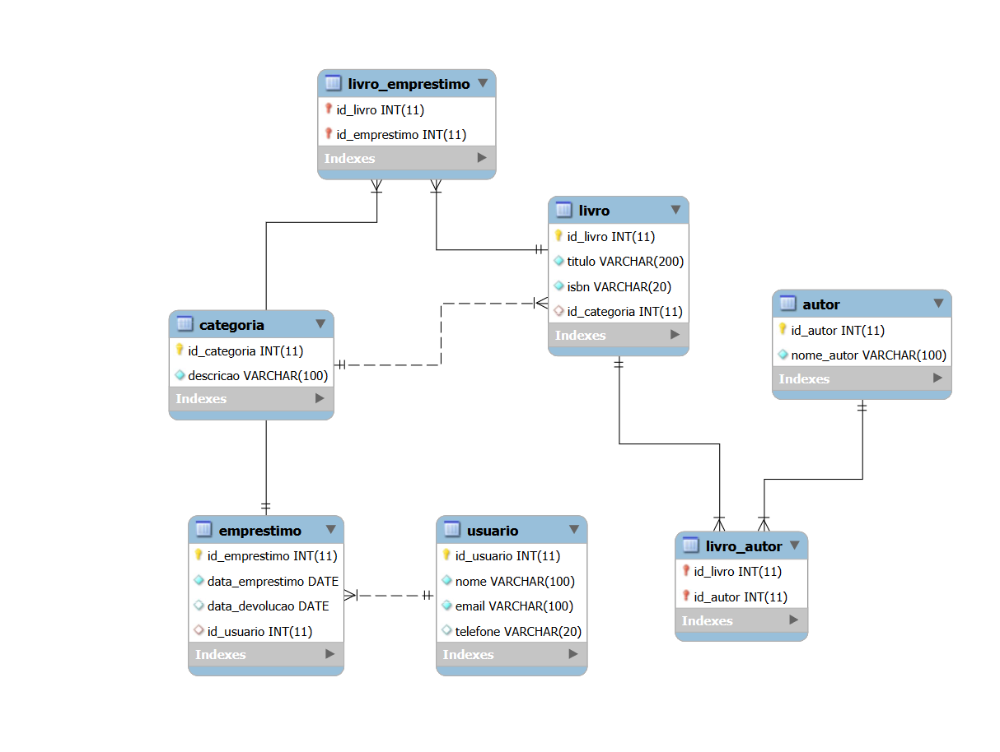

# Tema: Gerenciamento de Biblioteca Digital

## Este projeto implementa um sistema de gerenciamento de biblioteca usando um banco de dados relacional. Ele foi desenvolvido para facilitar o controle de usuários, livros, autores, categorias e empréstimos de forma organizada.

- Objetivos
    1. Automatizar o controle de livros e autores: Permitir o cadastro de livros, autores e suas respectivas categorias.
    2. Gerenciamento de usuários e empréstimos: Implementar um sistema para registrar usuários, gerenciar empréstimos de livros e rastrear devoluções.
    3. Organização e integridade dos dados: Manter um relacionamento adequado entre os dados, garantindo a integridade referencial e evitando inconsistências.
    4. Escalabilidade: Criar uma base sólida que permita a expansão futura do sistema, seja para novas funcionalidades ou para um maior volume de dados.
    
## O escopo do projeto inclui as seguintes funcionalidades:
1. Cadastro e gerenciamento de usuários.   
2. Cadastro e classificação de livros por categorias.   
3. Registro de autores e associação dos mesmos a seus livros.   
4. Controle de empréstimos e devoluções, associando usuários e livros.   
5. Relacionamentos N entre livros e autores, assim como entre livros e empréstimos. 

## Funcionalidades futuras podem incluir:
1. Relatórios detalhados sobre os empréstimos e devoluções.   
2. Integração com outros sistemas ou APIs.   
3. controle de multas para devoluções atrasadas.   

## Ferramentas
- As ferramentas utilizadas para o desenvolvimento deste projeto são:
1. MySQL: Para criação e gerenciamento do banco de dados.
2. MySQL Workbench: Para modelagem de dados e visualização das tabelas.
3. Git: Para controle de versão.
4. GitHub: Para hospedagem e colaboração no código do projeto.

## Tecnologias
- As tecnologias principais utilizadas no projeto são:
1. SQL: Linguagem de consulta estruturada para a criação e manipulação das tabelas e dados no banco de dados.
2. Chaves Primárias e Estrangeiras: Usadas para garantir a integridade referencial entre as tabelas.
3. Relacionamentos N Utilizados para modelar a relação entre livros, autores e empréstimos.
4. indices: Para melhorar o desempenho das consultas no banco de dados.

## Diagrama de ERD



## estrutura do repositorio
```
/biblioteca   
│   
├── /sql               # Pasta para os arquivos SQL   
│   ├── create_tables.sql   # Arquivo para criação de tabelas   
│   
├── /images            # Pasta para armazenar as imagens   
│   ├── schema.png         # Exemplo de imagem do diagrama   
│   ├── sample_output.png  # Exemplo de imagem do resultado   
│   
├── README.md          # Explicação do projeto   
```